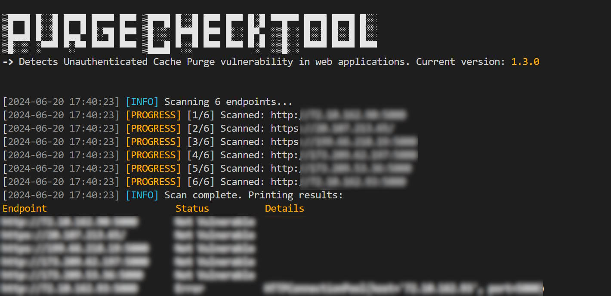

# PurgeCheckTool



PurgeCheckTool is a Python script designed to detects the Unauthenticated Cache Purge vulnerability in web applications. This vulnerability allows attackers to clear cached content without proper authentication, potentially leading to unauthorized data manipulation or denial of service (DoS) attacks.

## Features

- Detects unauthenticated cache purge vulnerabilities in web apps.
- Supports scanning single or multiple endpoints.
- Saves output results to a CSV file in /reports.
- Logs messages to a log file for further analysis in /logs.

## Prerequisites
- Python 3.x
- Required Python packages: `requests`, `urllib3`

## Installation

1. Clone the repository:

    ```bash
    git clone https://github.com/yourusername/PurgeCheckTool.git; cd PurgeCheckTool
    ```

2. Install the required packages:

    ```bash
    pip install -r requirements.txt
    ```

## Usage

To use PurgeCheckTool, you need to provide either a single URL or a file containing a list of URLs to scan.

### Scanning a Single URL

```bash
python pct.py -u <URL>
```

### Scanning Multiple URLs from a File

```bash
python pct.py -f <file>
```

## Output

1- Results are saved in a CSV file in the reports directory with a timestamped filename (e.g., report-2023-06-22-12-34-56.csv).
2- Logs are saved in the logs directory in a file named scan.log.


## Author

This tool was created by [M Ali](https://x.com/MohamedNab1l).


## Disclaimer

This provided tool is for educational purposes only. I do not encourage, condone, or support unauthorized access to any system or network. Use this tool responsibly and only on systems you have explicit permission to test. Any actions and consequences resulting from misuse of this tool are your own responsibility.
